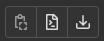

# UserScripts

GreaseMonkey UserScripts I've written.

## Installing scripts

To install a script, go to the folder of the script you want and select the file ending in `.user.js`.
Then, press the button to open it in a new tab. It should be the middle button of these three:



With a UserScript extension installed, pressing this should prompt you to install it.

## Building (Only needed for development)

Some scripts are written in TypeScript and need to be built to JavaScript before use.

```sh
# install dependencies
yarn install

# build
yarn build
```

Build files should be committed to the repo to avoid forcing users to build the scripts themselves.

## License

These scripts are licensed under the GNU General Public License, Version 3.0
([LICENSE](LICENSE) or <https://www.gnu.org/licenses/gpl-3.0.en.html>).
